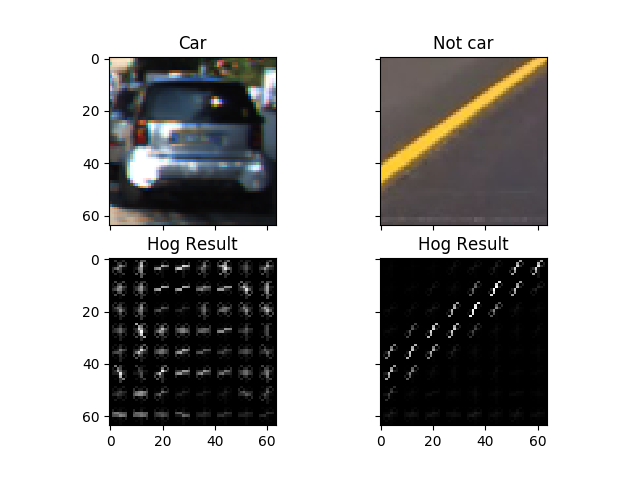
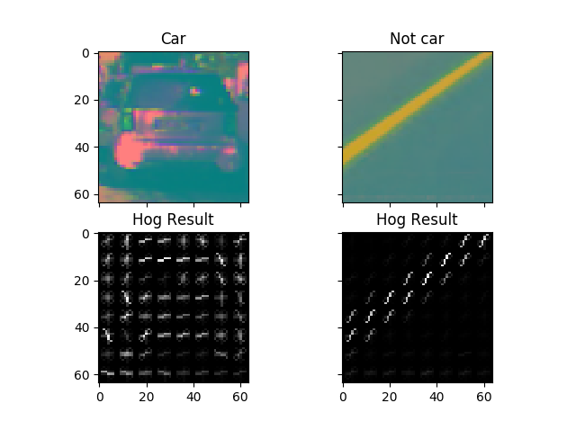

# CarND-Vehicle-Detection
The goal of the project is to experiment with different features for classifying vehicle vs non-vehicle. 
Then I used the training to detect vehicles on the road.

# Histogram of Oriented Grandient (HOG)
1. get_hog_features() function in helper.py from line to . 
I started by reading in one car and one not car image, called get_hog_features to get features and hog images.
Below is the result comparing side by side:

I then explored different color space and different _skimage.hog()_ parameters (orientations, pixels_per_cell, and cells_per_block).
I grabbed random images from each of the two classes and displayed then to get a feel for what
the _skimages.hog() output look like.

Here is an example using the YCrCb color space and HOG parameters of orientation=9, pixels_per_cell=(8,8) and cell_per_block=(2,2)

2. I tried various combinations of parameters and I decided to use YCrCb color space with HOG parameters of 
`orientations=9`, `pixels_per_cell=(8, 8)` and `cells_per_block=(2, 2)` because it shows the different
features output between car and not car.